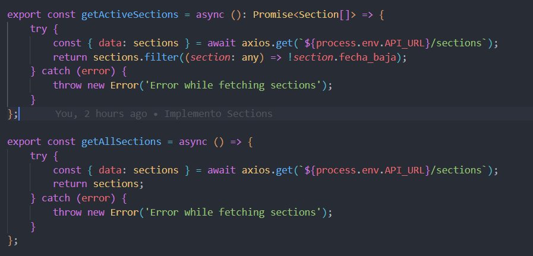
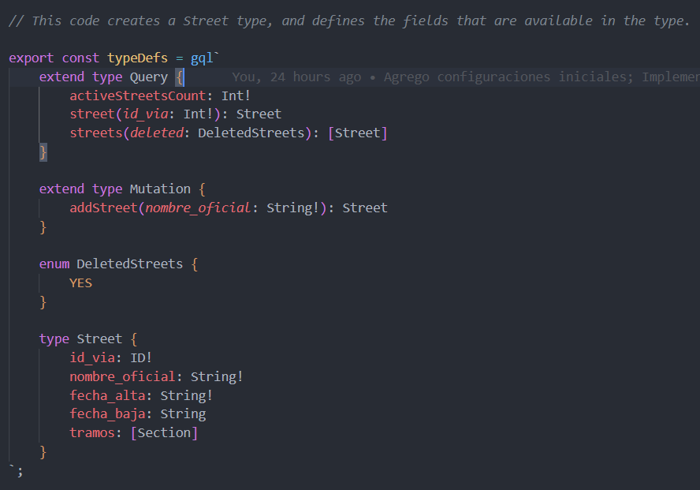

# Inteligencia Artificial

## Herramientas que uso

### ChatGPT

Me resulta muy util para:

-   Generar ideas
-   Tomar decisiones como que lenguaje o framework usar
-   Ayudarme cuando me trabo, no entiendo o no me acuerdo algo
-   Es mucho mas veloz que buscar en google
-   Explicarme un codigo que no entiendo
-   Refactorizar codigo

### Github Copilot

Lo uso para:

-   Generar codigo
-   Generar texto

### Phind

Es una [herramienta](https://www.phind.com/) que corre ChatGPT por detras, esta conectada a Internet y te dice las fuentes de donde saca la informacion. Lo uso cuando ChatGPT no puede terminar de ayudarme ya que en mi experiencia ChatGPT sigue siendo superior.
Una ventaja es que Phind no pide inicio de sesion para poder utilizarlo.

### Deepl

Es una [IA](https://www.deepl.com/translator) enfocada en traduccion de idiomas. La uso para traducir de Ingles a Español y viceversa. Ademas tiene una [opcion](https://www.deepl.com/write) para corregir o dar sugerencias de un texto que esta en Ingles. Incluso tiene una aplicacion de escritorio.

---

## Modo de uso

Hago todas las consultas en Ingles ya que lo considero mas eficiente y rapido. Ademas de que es el idioma que uso para programar y me sirve que los ejemplos de codigo me los escriba en Ingles, es mas eficiente trabajar en el idioma nativo de la herramienta tanto por la generacion de tokens que es mas costosa en español hasta que la herramienta deba traducir lo que escribi, procesar la respuesta y tener que volver a traducir para responderme.

Para los que quieran saber mas, aca hay una pagina que explica que son los [tokens](https://computerhoy.com/son-tokens-chatgpt-cual-limite-ocurre-superas-1240014) y aca hay otra para comparar la [cantidad de tokens](https://platform.openai.com/tokenizer) escribiendo en distintos idiomas.
Esto mas que nada importa al pagar ChatGPT pero no deja de ser mas eficiente escribir en Ingles.

### Generacion de ideas

### Toma de decisiones

A la hora de tomar decisiones como que tecnologia o framework usar se le pueden hacer preguntas a ChatGPT como:

-   What advantages do I have working with TypeScript instead of JavaScript?
-   In which cases is a good idea to implement a GraphQL server?

### Generacion de codigo

```ts
// generate street type with this properties
// id_via, nombre_oficial, fecha_alta, fecha_baja
export const typeDefs = gql`
    type Street {
        id_via: Int!
        nombre_oficial: String!
        fecha_alta: String!
        fecha_baja: String
    }
`;

// 9 ROMA
// 2432 CALLAO AV
// 236 RIVADAVIA AV.
// 132 PARAGUAY
// 573 LAPRIDA
// 812 JUNIN
// 933 SAN LUIS
// 1200 25 DE MAYO
// 1217 CASEROS AV.
// 2195 CHUBUT

//generate json of streets
const streets = [
    {
        id_via: 9,
        nombre_oficial: "ROMA",
        fecha_alta: "2000-01-01",
        fecha_baja: null,
    },
    {
        id_via: 2432,
        nombre_oficial: "CALLAO AV",
        fecha_alta: "2000-01-01",
        fecha_baja: null,
    },
    {
        id_via: 236,
        nombre_oficial: "RIVADAVIA AV.",
        fecha_alta: "2000-01-01",
        fecha_baja: null,
    },
    {
        id_via: 132,
        nombre_oficial: "PARAGUAY",
        fecha_alta: "2000-01-01",
        fecha_baja: "2018-12-31",
    },
    {
        id_via: 573,
        nombre_oficial: "LAPRIDA",
        fecha_alta: "2000-01-01",
        fecha_baja: null,
    },
    {
        id_via: 812,
        nombre_oficial: "JUNIN",
        fecha_alta: "2000-01-01",
        fecha_baja: null,
    },
    {
        id_via: 933,
        nombre_oficial: "SAN LUIS",
        fecha_alta: "2000-01-01",
        fecha_baja: null,
    },
    {
        id_via: 1200,
        nombre_oficial: "25 DE MAYO",
        fecha_alta: "2000-01-01",
        fecha_baja: null,
    },
    {
        id_via: 1217,
        nombre_oficial: "CASEROS AV.",
        fecha_alta: "2000-01-01",
        fecha_baja: null,
    },
    {
        id_via: 2195,
        nombre_oficial: "CHUBUT",
        fecha_alta: "2000-01-01",
        fecha_baja: null,
    },
];
```

Cuando no recuerdo como se hace algo le pregunto a ChatGPT, aca dejo un ejemplo de como usar el .env en node:

[Link a ChatGPT](https://chat.openai.com/share/fd7b8271-0f0e-4d98-8343-3a719582f4da)

### Refactorizacion

Tenia un codigo que no me convencia, estaba tratando de seguir el consejo de Clean Code sobre que una funcion deberia hacer una y solo una cosa, y el pasarle un booleano de parametro no es una buena practica pero era mucho codigo duplicado, entonces decidi ejecutar el "Make Robust" de Github Copilot Labs. El resultado no fue el que esperaba pero me agrego todos los try catch que faltaban en las funciones.



Despues de eso le pedi ayuda a ChatGPT, dejo el link de la consulta [aca](https://chat.openai.com/share/ce22b776-3059-457b-a712-1d4c50d9da54).

Despues se me ocurrio una forma mas prolija que es como quedo, el codigo se puede ver en `/services/section-service.ts`.

Como el "Make Robust" funciono tan bien quise usarlo a lo largo de toda la aplicacion y me rompio la funcionalidad. Tambien quise usar el "Add Types" pero tampoco funciono como debia. Para este tipo de cosas me parece mucho mas eficiente ChatGPT porque ademas recordemos que Labs es una tecnologia que esta en beta.

### Explicacion de codigo

Esto es util solo cuando se trabaja con codigo que no escribio uno mismo, por ende voy a poner un ejemplo que no pertenece al proyecto.

Por ejemplo, este mes el cliente de CABA nos pidio que hagamos un endpoint equivalente a uno que estaba en otro proyecto. Para poder comprender lo que ya estaba hecho en una tecnologia que no conozco rapido y facil puse un prompt como:

-   Can you tell me what is this code?
-   Can you explain this code to me?

junto con el codigo que se quiera entender. Y si es necesario se repregunta sobre una parte especifica de la misma forma.

### Refactorizacion de codigo

### Documentacion

Trate de usar "Document" the Labs y de nuevo no funciono como esperaba o al menos no era lo que yo queria. Me parece que agregar un comentario al codigo no suma para nada y ni siquiera me dejo documentar todo el archivo a la vez. Me parece que si necesito entender el codigo no voy a usar eso y para lo que yo pretendia usarlo era para entregarselo al cliente.



Y decidi usar ChatGPT para ver si me daba algo mas util para el cliente, dejo el link a la [consulta](https://chat.openai.com/share/02b705d2-a6c0-4a82-91c2-b57d2afe2154) y el resultado se puede ver en la carpeta docs.

### Testing
